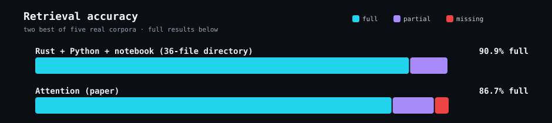
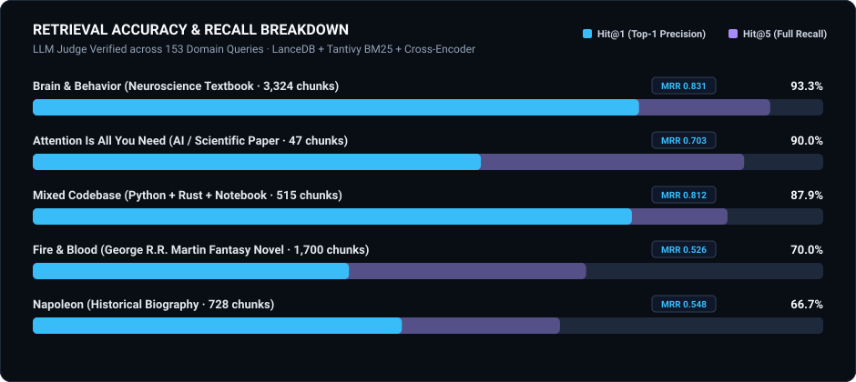

<div align="center">



<br>

[](#quick-start)
[](#what-sets-this-apart)
[](#how-it-works)
[](LICENSE)

**A coding agent should not have to choose between opening files one at a time and dumping an entire repository into context.**

[Install](#quick-start) • [Evals](#benchmark--retrieval-evaluations) • [How it works](#how-it-works) • [State](#current-state)

</div>

## Benchmark & Retrieval Evaluations

Evaluated against the **[open-rag-eval](https://github.com/vectara/open-rag-eval)** taxonomy ($top\_k=5$, isolated local retrieval with no reranker, local `qwen3-embedding:8b` via Ollama + BM25 hybrid search):

| Corpus / Domain | Total Queries | Strict Relevance (Score 3 / Exact) | Lenient Relevance (Score $\ge$ 2 / Full+Partial) | Miss Rate (Score $\le$ 1 / Miss) |
| :--- | :--- | :--- | :--- | :--- |
| **Attention Paper** (Scientific / AI) | 30 | **86.7%** (26/30) | **96.7%** (29/30) | 3.3% (1/30) |
| **Brain & Behavior** (Neuroscience) | 30 | **76.7%** (23/30) | **93.3%** (28/30) | 6.7% (2/30) |
| **Napoleon V2** (1000-char hybrid) | 30 | **66.7%** (20/30) | **90.0%** (27/30) | 10.0% (3/30) |
| **Napoleon V1** (300-char chunks) | 30 | **53.3%** (16/30) | **83.3%** (25/30) | 16.7% (5/30) |
| **Fire & Blood** (Narrative Fiction) | 30 | **46.7%** (14/30) | **80.0%** (24/30) | 20.0% (6/30) |
| **Mixed Codebase** (Py/Rust/IPYNB) | 33 | **90.9%** (30/33) | **100.0%** (33/33) | 0.0% (0/33) |
| **Elpis Memories Crate** (Rust) | 15 | **73.3%** (11/15) | **100.0%** (15/15) | 0.0% (0/15) |
| **rag-mcp Codebase** (Python Server) | 15 | **80.0%** (12/15) | **93.3%** (14/15) | 6.7% (1/15) |
| **Notebook Corpus** (JSON/Code) | 10 | **100.0%** (10/10) | **100.0%** (10/10) | 0.0% (0/10) |
| **Overall Baseline** | **203** | **74.9%** (152/203) | **92.1%** (187/203) | 7.9% (16/203) |

<br>

## Quick start

Prerequisites: Python 3.10+ and [`uv`](https://docs.astral.sh/uv/getting-started/installation/).

```bash
git clone https://github.com/MasihMoafi/rag-mcp
cd rag-mcp
python scripts/bootstrap.py
```

That single command installs dependencies and runs the test suite.

Manual equivalent:

```bash
uv sync --group dev
.venv/bin/python -m pytest tests/ -v
```

Then register the server with an MCP client.

### Claude Code

```bash
claude mcp add rag -s user -- /absolute/path/to/rag-mcp/.venv/bin/python /absolute/path/to/rag-mcp/server.py
```

### Codex / Elpis

Add to `~/.codex/config.toml`:

```toml
[mcp_servers.rag]
command = "/absolute/path/to/rag-mcp/.venv/bin/python"
args = ["/absolute/path/to/rag-mcp/server.py"]

[mcp_servers.rag.env]
RAG_MCP_WORKSPACE_ROOT = "/absolute/path/to/your/project"
```

Expected result: the client discovers `query_knowledge_base`, and a query returns ranked passages with source paths from the requested scope.

## What is rag-mcp

`rag-mcp` is a local hybrid-search MCP server: point it at a file or folder, ask a question in plain language, and get back the passages that actually answer it — with the exact file and location, not a guess.

Coding agents normally search a codebase by opening files one at a time or dumping an entire repository into the conversation. Both waste time and context. `rag-mcp` replaces that with one tool call: search by meaning, get ranked results with sources, keep going. Embeddings, vector search, and reranking all run locally; the server exposes one read-only MCP tool to compatible clients.

No third-party logo or benchmark — the image above is the actual [retrieval-accuracy evidence](#retrieval-accuracy) this repo ships, not decoration.

## Retrieval accuracy



Recorded, reproducible retrieval runs live under [`evals/`](evals/) — not part of CI, kept
as evidence. Every point in the chart is a question-level grade from a recorded
`query_knowledge_base` run, graded against a known answer — not simulated.

The top result is a single real directory containing
a 29-file Rust crate, 6 Python scripts, and a Jupyter notebook, searched with `doc_path`
pointed at the whole directory — the server has to find the right file among three
languages, not just the right passage in one document. The other five rows are
single-document or project-scoped runs: a notebook, two books, a paper, a novel, and
the rag-mcp codebase itself.

The chart reports exact full answers separately from answers that were full or partial.
The codebase and structured-document rows are easier to retrieve exactly; the long
narrative rows contain more interpretive answers spread across passages, which makes
chunk-based retrieval less reliable. This is a description of these recorded runs, not
a claim about every corpus or a benchmark against other retrieval tools.

[Per-question results for every corpus](evals/) — including where each miss actually failed
(vague topical overlap, a truncated chunk, or the fact genuinely absent from top-k).

An earlier, now-superseded Napoleon run with reranking manually disabled scored 93.3% —
that number describes raw BM25+vector retrieval in isolation, not this server as it actually
runs, and is kept in [`evals/napoleon/experiment_log.md`](evals/napoleon/experiment_log.md)
only for its chunk-size finding (1000 characters beat 300). The earlier separate Rust-only
and notebook-only runs are likewise superseded by the combined directory test above and kept
under `evals/elpis-memories-crate/` and `evals/notebook/` only as raw evidence.

This is six recorded corpora at one point in time — not a benchmark against other
retrieval tools.

## The problem

Coding agents commonly retrieve context by either opening files one by one or loading a large portion of the repository. The first can miss relevant files; the second consumes context with material the current task may not need.

`rag-mcp` moves retrieval into one local tool call so the agent can search by meaning without making the entire tree part of every prompt.

## How it works

```text
query + optional path
        ↓
chunking
        ↓
BM25 lexical search + local embeddings / Qdrant
        ↓
Reciprocal Rank Fusion
        ↓
CrossEncoder reranking
        ↓
ranked chunks + exact source paths
```

Repository structure:

```text
rag-mcp/
├── server.py       # stdio JSON-RPC MCP host
├── rag/            # chunking, BM25, vector search, reranking
└── utils/proxy.py  # local proxy-environment handling
```

Technical boundaries:

- one MCP tool: `query_knowledge_base(query, doc_path?)`;
- default embeddings: `all-MiniLM-L6-v2` (~80MB, fast — overridable, see Configuration);
- reranking runs by default: `cross-encoder/ms-marco-MiniLM-L-6-v2` (~80MB, fast — overridable, or disable it entirely);
- local embedded/on-disk Qdrant;
- `doc_path` can scope each call to a file or directory;
- per-path indexes are persisted under `rag/rag_db_v2/`;
- common large/build directories such as `.git`, `node_modules`, `.venv`, `dist`, `build`, and `target` are rejected;
- configurable depth/token limits fail explicitly instead of scanning an unbounded tree.

### Configuration

Every retrieval knob is an environment variable, not a source edit. Unset means the
default shown:

| Variable | Default | What it controls |
| --- | --- | --- |
| `RAG_MCP_EMBED_PROVIDER` | `sentencetransformer` | `sentencetransformer` (local), `ollama` (local server), or `openai_compatible` (remote — see below) |
| `RAG_MCP_EMBED_MODEL` | `all-MiniLM-L6-v2` | embedding model name, meaning depends on provider |
| `RAG_MCP_EMBED_API_KEY` | unset | API key, only used by `openai_compatible` |
| `RAG_MCP_EMBED_BASE_URL` | unset (official OpenAI endpoint) | override endpoint, only used by `openai_compatible` |
| `RAG_MCP_RERANKER_TYPE` | `cross-encoder` | `cross-encoder` or `disabled` |
| `RAG_MCP_RERANKER_MODEL` | `cross-encoder/ms-marco-MiniLM-L-6-v2` | reranker model, used when type is `cross-encoder` |
| `RAG_MCP_TOP_K` | `5` | candidates pulled from vector search before fusion |
| `RAG_MCP_RERANK_TOP_K` | `5` | results kept after reranking |
| `RAG_MCP_CHUNK_SIZE` | `700` | characters per chunk before overlap |
| `RAG_MCP_CHUNK_OVERLAP` | `100` | characters shared between adjacent chunks |
| `RAG_MCP_RRF_K` | `60` | Reciprocal Rank Fusion constant |
| `RAG_MCP_MAX_DEPTH` | `20` | directory-scan depth limit |
| `RAG_MCP_MAX_TOKENS` | `2000000` | directory-scan size limit |

The shipped defaults are the small, fast pair (~80MB each) the evals above were run
against — not the largest model available, and 100% local: no key, no network call,
no per-query cost.

`openai_compatible` is the one non-local option: it leaves the machine. One client
implementation covers real OpenAI, Ollama's own `/v1` endpoint, and Qwen/DashScope's and
Gemini's OpenAI-compatible modes — install the optional `openai` package
(`uv sync --extra openai`), then set `RAG_MCP_EMBED_PROVIDER=openai_compatible`,
`RAG_MCP_EMBED_MODEL` to the provider's model name, `RAG_MCP_EMBED_API_KEY`, and
`RAG_MCP_EMBED_BASE_URL` if the provider isn't OpenAI itself. The client construction is
verified; a real embedding call against a paid provider is not — test it against your own
key before trusting it. A cross-encoder reranker type named `llm` also exists in the code
but its scoring is unimplemented scaffolding (every passage gets the same score) — do not
set it, it does nothing useful.

Swapping any of this is an environment variable in the server's MCP registration, no code
change. Example, in `~/.codex/config.toml`:

```toml
[mcp_servers.rag.env]
RAG_MCP_WORKSPACE_ROOT = "/absolute/path/to/your/project"
RAG_MCP_EMBED_PROVIDER = "ollama"
RAG_MCP_EMBED_MODEL = "qwen3-embedding:8b"
```

## Current state

### Implemented and verified

- MCP `initialize` → `tools/list` → `tools/call` protocol path.
- Read-only `query_knowledge_base` tool.
- Workspace-root and explicit `doc_path` scoping.
- Local hybrid retrieval and reranking.
- Guardrails for excluded directories and oversized scopes.
- Text extraction for PDF and Jupyter notebooks, plus local OCR for common image
  formats and structured extraction for DOCX, PPTX, XLSX, and CSV files.
- End-to-end registration was exercised through a real MCP client during development.

### Implemented but not yet covered by the current tests

- The alternative Ollama embedding-provider path in `rag/core.py`.
- The `openai_compatible` embedding provider: client construction is verified, a real
  call against a paid provider is not.

### Planned

Nothing is formally tracked yet. Extend it when a concrete retrieval failure or client requirement appears.

### Intentionally unsupported

- Hosted/remote vector databases.
- File types outside the extension allowlist in `server.py`.
- Write/mutation tools; this server is retrieval-only.

## What sets this apart

These are design choices, not novelty claims:

- **Local retrieval:** source files, embeddings, vector search, and reranking stay on the machine.
- **Small transport layer:** the MCP host uses direct stdio JSON-RPC rather than depending on an MCP SDK.
- **Per-call scope:** one server can search different files/directories instead of requiring one fixed knowledge base per project.
- **Evidence in the response:** returned chunks include source paths rather than only synthesized prose.

## Evals and test series

The test suite lives under `tests/`:

```bash
python scripts/bootstrap.py
```

They cover:

- read-only tool annotations;
- default workspace scoping;
- explicit `doc_path` scoping;
- rejection of excluded directories;
- rejection of depth-limit violations;
- bootstrap prerequisite checks;
- extraction from DOCX, PPTX, XLSX, and CSV files;
- local OCR extraction from a generated image fixture.

Protocol-level check, without another MCP client:

```bash
printf '%s\n%s\n%s\n' \
  '{"jsonrpc":"2.0","id":1,"method":"initialize","params":{"protocolVersion":"2025-06-18"}}' \
  '{"jsonrpc":"2.0","id":2,"method":"tools/list"}' \
  '{"jsonrpc":"2.0","id":3,"method":"tools/call","params":{"name":"query_knowledge_base","arguments":{"query":"how does reciprocal rank fusion combine bm25 and vector results"}}}' \
  | RAG_MCP_WORKSPACE_ROOT="$PWD" .venv/bin/python server.py
```

A successful self-query should return evidence pointing at the RRF implementation in `rag/core.py`.

What the tests prove: MCP transport/scoping/guardrail behavior covered by those cases.

What they do **not** prove: retrieval quality across arbitrary corpora, cross-client compatibility, or superiority to grep/code-search/RAG alternatives.

## Example

```text
query_knowledge_base(
  "how does retry backoff work for failed jobs",
  doc_path="codex-rs/memories"
)
```

The response is intended for the calling agent: ranked source passages it can use as task context rather than a standalone chat answer.

## Future development

Keep the surface small. Add capability only when real usage shows a retrieval, compatibility, or performance gap worth testing.

## License

MIT — see [LICENSE](LICENSE).
